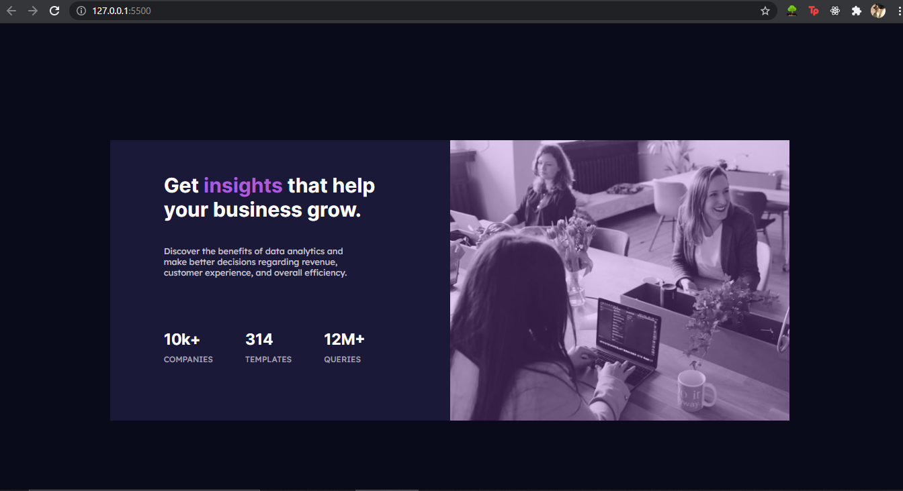

# Frontend Mentor - Stats preview card component solution

This is a solution to the [Stats preview card component challenge on Frontend Mentor](https://www.frontendmentor.io/challenges/stats-preview-card-component-8JqbgoU62). Frontend Mentor challenges help you improve your coding skills by building realistic projects. 

## Table of contents

- [Overview](#overview)
  - [The challenge](#the-challenge)
  - [Screenshot](#screenshot)
  - [Links](#links)
- [My process](#my-process)
  - [Built with](#built-with)
  - [What I learned](#what-i-learned)
  - [Author](#author)


**Note: Delete this note and update the table of contents based on what sections you keep.**

## Overview

Made a responsive web template using HTML and CSS.

### The challenge

Users should be able to:

- View the optimal layout depending on their device's screen size

### Screenshot



### Links

- Solution URL: [github](https://github.com/masterrachit777/stats-preview-card/)
- Live Site URL: [Add live site URL here](https://your-live-site-url.com)

## My process

Built a simple website with desktop-first view, then used media queries to make it responsive.

### Built with

- Semantic HTML5 markup
- CSS custom properties
- Flexbox
- Desktop-first workflow

### What I learned

I learned a lot of things, like use of position and display in css. Learned how to use sass.
Also learned lot of other css properties which were not known to me earlier.

```html
<h1>Some HTML code I'm proud of</h1>
```
```css
.proud-of-this-css {
  color: papayawhip;
}
```
```js
const proudOfThisFunc = () => {
  console.log('🎉')
}
```

## Author

- Frontend Mentor - [@masterrachit777](https://www.frontendmentor.io/profile/masterrachit777)
- Twitter - [@racayu1221](https://www.twitter.com/racayu1221)
